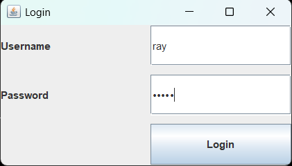
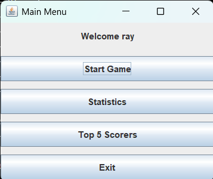
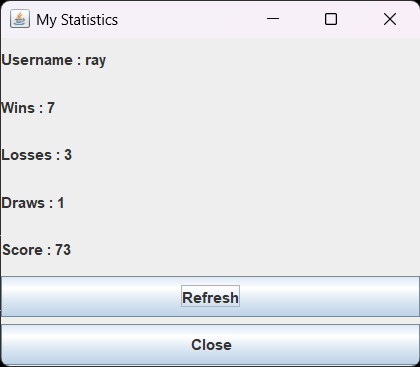
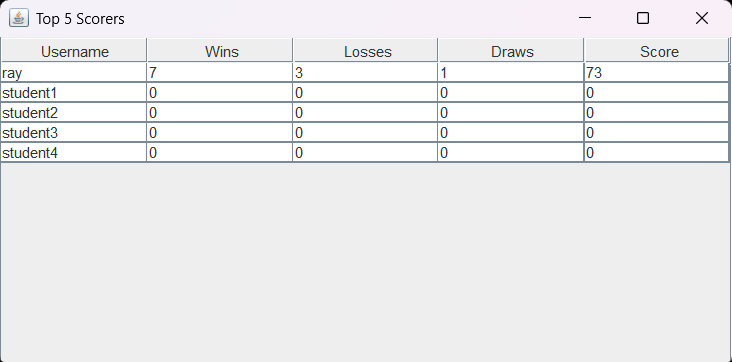
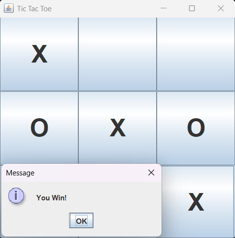

# Simple Tic Tac Toe Game

## Student Information

Name : Ahnaf Rayhan Nurducha

NRP : 5026251145

Class : A

---

## Project Description

Simple Tic Tac Toe Game using Java Swing and PostgreSQL.

Features:

- Login
- Play Tic Tac Toe
- Statistics
- Top 5 Scorers
- PostgreSQL Database

---

## Technologies

- Java
- Java Swing
- PostgreSQL
- JDBC
- VS Code

---

## Database

Database name:

game_project

Table:

players

---

## How to Run

1. Install PostgreSQL.
2. Create database `game_project`.
3. Execute `database/schema.sql`.
4. Configure DatabaseManager.java.
5. Run Main.java.

---

## Screenshots

## Login

## Main Menu

## Statistics

## Top 5 Scorers

## Game

---

## Video

(YouTube Link)
